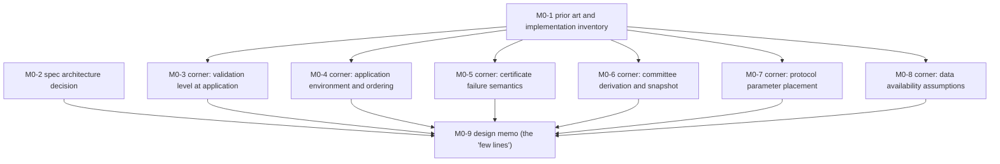
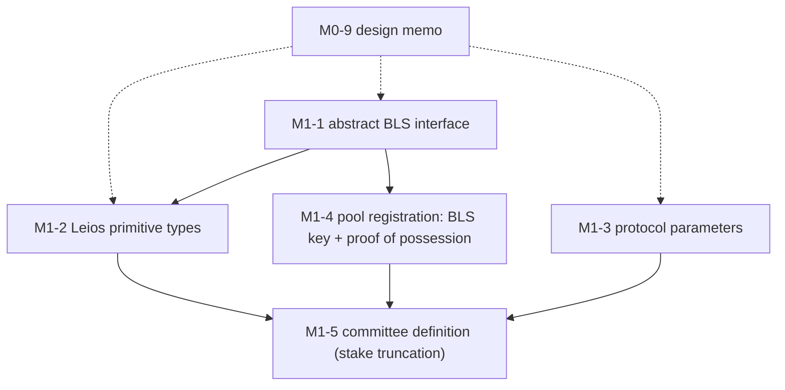
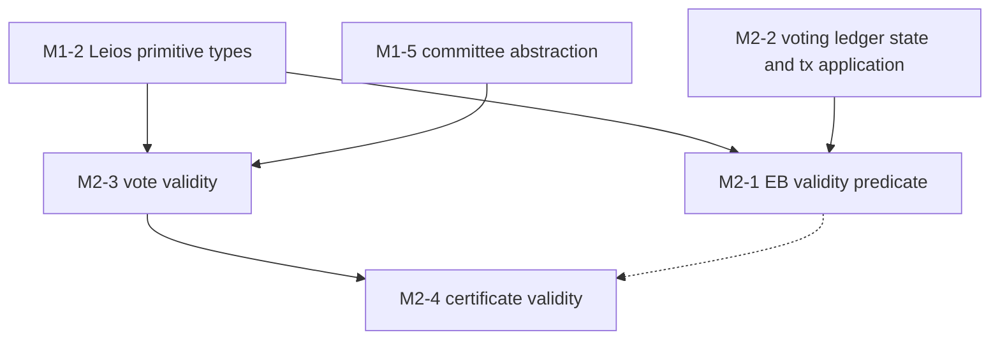
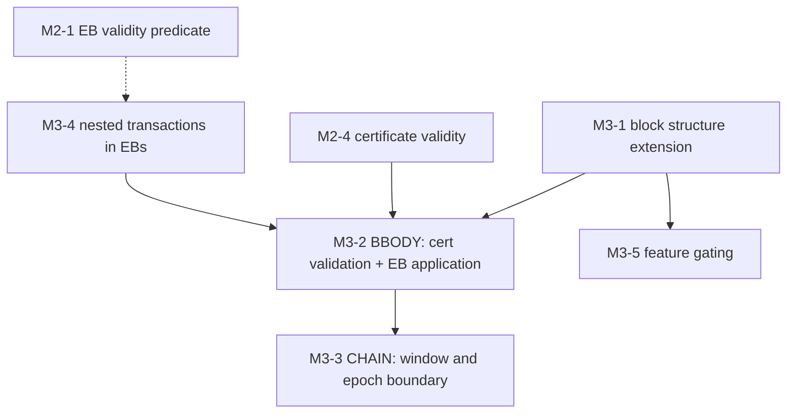
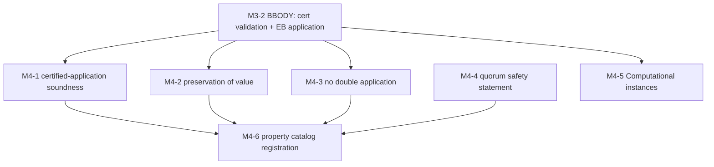
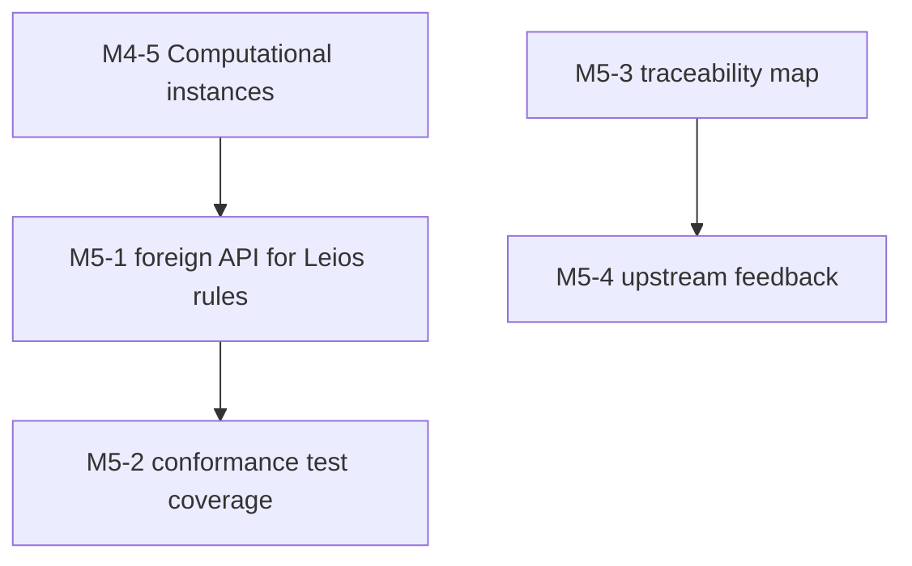
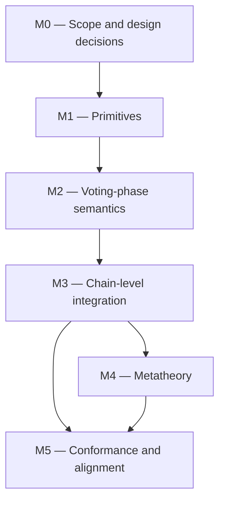

<!--
File: docs/GITHUB_PROJECT.md

Project plan for the Leios ledger formalization, staged on the
`leios-main` branch.

This file is partially generated by the williamdemeo/github-project
engine (gh_project_populate.py / gh_project_update.py).  Manual prose
(summary, milestone descriptions, exit criteria, dependency graphs) is
hand-edited.  Issue listings between

    BEGIN GENERATED: milestone-N
    ...
    END GENERATED: milestone-N

markers are the input to the first `populate` run; after that they are
regenerated from GitHub state by `update`, and edits inside the regions
are overwritten.  Structure lives here; state (issue numbers,
open/closed, assignees) lives on GitHub.

STATUS: DRAFT, not yet populated.  Populating creates six milestones,
six milestone labels, and roughly thirty issues on the shared
IntersectMBO repository, so coordinate with the team before running it:

    python3 <engine>/scripts/gh_project_lint.py     docs/GITHUB_PROJECT.md
    python3 <engine>/scripts/gh_project_populate.py docs/GITHUB_PROJECT.md --dry-run
-->

# Leios ledger formalization — project roadmap

**Project Title**:  Ledger rules for Ouroboros Leios in the formal ledger specification

**Repository**:  `IntersectMBO/formal-ledger-specifications`

---

## Summary

Ouroboros Leios (CIP-164) raises Cardano's throughput by letting a block producer
announce an *endorser block* (EB) of transactions alongside its ordinary
*ranking block* (RB); a committee of stake pools, fixed for the epoch by stake-based
truncation, votes on the EB, a quorum of votes is aggregated into a *certificate*,
and the immediately following RB may carry that certificate, at which point the EB's
transactions enter the ledger.  Today every one of those steps is enforced by
convention in the consensus prototype: the cardano-ledger prototype
(PR [#5626](https://github.com/IntersectMBO/cardano-ledger/pull/5626)) contributes
only data-carrying fields, no rule validates a certificate or a quorum, and the
consensus code applies certified transactions through the existing ledger API with
validation switched off.

This plan is the formal-methods counterpart: specify, in Agda, the ledger-side rules
of Leios so that the convention becomes law before the implementation migrates it.
The work covers the following:

+  the new primitive types (EBs, votes, certificates) and an abstract BLS signature
   interface;
+  the new protocol parameters and the BLS key in pool registration;
+  the voting-phase semantics behind the consensus↔ledger interface proposed by
   Nicolas Frisby (`initializeVotingLedgerState`, `applyTxForVoting`, `validateVote`,
   `validateCertificate`, ...);
+  certificate validation and certified-EB application in the BBODY and CHAIN rules,
   including the slot/epoch environment questions;
+  the metatheory that justifies the design (certified application needs no
   re-validation, preservation of value, no double application);
+  conformance plumbing (Haskell extraction of the new rules) and a running
   traceability map against the implementation.

Work happens on the `leios-main` branch under the workflow documented in
`CONTRIBUTING.md`: branch off `leios-main`, PR back to `leios-main`; changes useful
independently of Leios go to `master` first and are merged in.  The umbrella tracking
issue is [#1295](https://github.com/IntersectMBO/formal-ledger-specifications/issues/1295).

The sequencing principle: decisions before mechanization.  Milestone 0
settles the design questions (the "corners" that will bite a naive
few-lines spec) in prose with the consensus and ledger implementers;
Milestones 1–3 mechanize the agreed design; Milestone 4 proves the
properties that make the design trustworthy; Milestone 5 connects the
result to conformance testing and feeds findings back upstream.

---

## Labels

The `milestone-N-*` labels are load-bearing: populate attaches them, and
update uses them to decide which generated region an issue belongs to.
The remaining labels already exist on the repository and are reused
exactly as named there.

- `milestone-0-design` (b60205) — Milestone 0: Scope and design decisions.
- `milestone-1-primitives` (d93f0b) — Milestone 1: Crypto, types, and protocol parameters.
- `milestone-2-voting` (fbca04) — Milestone 2: Voting-phase semantics.
- `milestone-3-chain` (0e8a16) — Milestone 3: Chain-level integration.
- `milestone-4-properties` (1d76db) — Milestone 4: Metatheory.
- `milestone-5-conformance` (5319e7) — Milestone 5: Conformance and alignment.
- `Leios` (c58af2) — Ouroboros Leios.
- `era: dijkstra` (d4c5f9) — Dijkstra-era specification.
- `conformance` (2BF63B) — Conformance testing interface.
- `property` (68FC9E) — Property statements and proofs.
- `discussion` (006b75) — Needs a design discussion or decision.
- `documentation` (0075ca) — Documentation.
- `haskell interface` (ededed) — Haskell extraction and the foreign API.
- `intra-era-hardfork` (3A433C) — Feature gating within an era.

---

## Milestones

### Milestone 0 — Scope and design decisions

**Description:**

Settle, in prose and with the implementers (Dražen, Javier, Nicolas,
Alexey, Polina), the design questions that determine what the Agda will
say: where the spec modules live, what a certificate certifies, in which
ledger-state environment certified transactions are applied, what an
invalid certificate does to a block, how the committee is derived, which
parameters are governed, and what the ledger assumes about data
availability.  The milestone's headline deliverable is the design memo
Ramsay asked for: the "few lines", written precisely, with each corner
either resolved or explicitly flagged.  Target window: through early
September 2026.

**Exit criterion:**

The design memo is merged on `leios-main` and has been reviewed by at
least one consensus implementer and one ledger implementer; every corner
issue records a decision (or a named blocker), and the memo's interface
table gives a ledger-side meaning to each function in the proposed
consensus↔ledger interface.

Issue dependencies:

---

### Milestone 1 — Primitives: crypto, types, and protocol parameters

**Description:**

Mechanize the building blocks: an abstract BLS signature interface in
the core crypto structure, the Leios primitive types (endorser blocks,
votes, certificates), the new protocol parameters with their governance
groups, the BLS key in pool registration with its proof of possession,
and the committee definition.  Everything here is additive
and independently mergeable.  Target window: September 2026.

**Exit criterion:**

`leios-main` type-checks under `--safe` with the new modules; the
parameter record covers the CIP-164 parameter list with group
assignments and well-formedness; pool registration carries and checks
the BLS key; the committee is a definable function of the ledger state.

Issue dependencies:

---

### Milestone 2 — Voting-phase semantics

**Description:**

Specify what honest voters check, and hence what a certificate means.
This is the ledger side of the proposed consensus↔ledger voting
interface: the voting ledger state and its initialize/forget
projections, transaction application for voting with EB-dimension
accounting, vote validity, and certificate validity.  The central
definition is the EB validity predicate; it is what Milestone 4's
soundness theorem connects to certified application.  Target window:
October 2026.

**Exit criterion:**

The spec defines `ValidEB`, vote validity, and certificate validity as
relations (with computable deciders where the design calls for them),
and each function in the proposed consensus↔ledger interface either has
a formal counterpart or a recorded reason why it is consensus-only.

Issue dependencies:

---

### Milestone 3 — Chain-level integration

**Description:**

Put Leios into the block rules: extend the block structure with the EB
announcement and the certificate, extend BBODY with certificate
validation and certified-EB application (in the environment and order
decided in Milestone 0), enforce the announcement-to-certification
window at the CHAIN level, work out the interaction with Dijkstra's
nested transactions, and gate the whole feature on protocol version.
Target window: November 2026.

**Exit criterion:**

The CHAIN rule accepts exactly the blocks the design memo says it
should: a block with a valid certificate applies the certified EB's
transactions in the specified environment; a block with an invalid
certificate is rejected with a predicate failure; the certification
window and epoch-boundary behavior are enforced by rule, not
convention.

Issue dependencies:

---

### Milestone 4 — Metatheory

**Description:**

Prove the properties that justify the design.  The headline theorem is
certified-application soundness: transactions that pass the voting-phase
checks can be applied without re-validation, and the result agrees with
fully validated application.  Around it sit preservation of value
through the new rules, no-double-application, the conditional quorum
safety statement, and the Computational instances that make the rules
executable.  Target window: November–December 2026.

**Exit criterion:**

The soundness and preservation-of-value theorems are proved under
`--safe` for the extended BBODY; every new rule has a Computational
instance; each property is stated in the catalog with its status
derived from the Agda, not declared.

Issue dependencies:

---

### Milestone 5 — Conformance and alignment

**Description:**

Connect the spec to the implementation in both directions: extract the
new rules through the foreign/Haskell interface so conformance tests can
exercise them, keep a living traceability map between spec rules and the
implementation (cardano-ledger and consensus), and file upstream issues
for the divergences the formalization uncovers.  Target window: December
2026 onward, rolling.

**Exit criterion:**

The extracted Haskell API exposes the Leios rules; a conformance test
runs at least the certificate-validation and EB-application paths
against the extracted code; the traceability document maps every
interface function and every corner decision to its implementation
counterpart, and each known divergence has an upstream issue.

Issue dependencies:

---

### Milestone dependencies

Hand-authored; update never touches it.

---

## Issues

Each issue below carries its milestone, labels, and a body ready for
GitHub.  On first populate, the `[MN-k]` ID in each heading becomes a
`[MN-k]` title prefix on GitHub (the join key that keeps re-runs
idempotent) and the new issue number is written back into the heading as
a `(#N)` suffix.

## Milestone 0 — Scope and design decisions

<!-- BEGIN GENERATED: milestone-0 -->

### Issue M0-1: Inventory prior art and the implementation state

**Labels:** `milestone-0-design`, `Leios`, `documentation`
**Milestone:** 0. Scope and design decisions

Three bodies of existing work bear on this spec and must not be
rediscovered or silently contradicted: the running consensus prototype,
the cardano-ledger prototype, and prior formal work on Leios.  Produce a
short survey document (`docs/leios/prior-art.md`, location subject to
M0-2) recording, with links, the following:

- [ ] CIP-164's ledger-relevant content, digested into a requirements
      list: the normative statements the ledger rules must enforce
      (block-structure changes, vote and certificate validity, committee
      selection, parameters, application semantics).
- [ ] What the consensus prototype enforces today and where: the
      closure-then-tick-then-block application flow, certificate
      verification with its hardcoded 3/4 quorum and 10-slot
      certification gap, the fabricated everyone-votes committee, and
      the three "this is like a ledger error" TODOs.
- [ ] What cardano-ledger PR
      [#5626](https://github.com/IntersectMBO/cardano-ledger/pull/5626)
      actually adds (data carriage only: certificate and announcement
      fields in the Dijkstra block body, `spsLeiosKey` in pool params,
      CDDL) and what issue
      [#5965](https://github.com/IntersectMBO/cardano-ledger/issues/5965)
      proposes for parameters.
- [ ] The named ledger requirements in the Leios design document
      (`ouroboros-leios`, `docs/leios-design`, section "Ledger"):
      REQ-LedgerTxNoValidation, REQ-LedgerCheapReapply,
      REQ-RegisterBLSKeys / REQ-RotateBLSKeys,
      REQ-StakeBasedCommitteeSelection, REQ-LedgerStateVotingCommittee,
      REQ-KeylessSeat, REQ-CheckProofOfPossession,
      REQ-LedgerCertificateVerification, and the serialization
      requirements.  This is the implementation team's own register;
      the traceability map (M5-3) keys on it.
- [ ] The ledger-facing interface of the protocol-level Agda spec
      (`input-output-hk/ouroboros-leios-formal-spec`): `LeiosAbstract`
      (with `splitTxs`), `BaseAbstract` (whose `RankingBlock` carries
      `txsOrEbCert : List Tx ⊎ EBCert`, and whose `V-chkCerts` is
      exactly the certificate check this spec will define), and
      `VotingAbstract`.  Note the representation gap (its EBs carry
      full transaction lists; CIP-164 EBs carry references) and sketch
      how this ledger spec would instantiate `BaseAbstract`.
- [ ] Polina Vinogradova's branches on this repository:
      `polina/txcomm` (a transaction reordering/commutativity theorem
      for LEDGER, with a postulate-free lemma layer) and
      `polina/tiered` / `polina/dynamic` (tiered pricing and mempool
      design for Linear Leios, with `forgeBlock` returning a block and
      an optional EB); identify concretely what to reuse.

Acceptance criterion: the design memo (M0-9) can cite this survey for
every claim it makes about existing work.

---

### Issue M0-2: Decide where the Leios spec lives and how it is parameterized

**Labels:** `milestone-0-design`, `Leios`, `era: dijkstra`, `discussion`
**Milestone:** 0. Scope and design decisions

The implementation prototypes Leios in the Dijkstra era, and the spec
already has `src/Ledger/Dijkstra/Specification/` mirroring Conway.
Decide the following before any module is written:

- [ ] **Namespace.**  Extend Dijkstra modules in place, add a subtree
      `Ledger.Dijkstra.Specification.Leios.*`, or start a separate era.
      Proposed default: the additive subtree, plus minimal edits to
      `BlockBody`, `Chain`, `PParams`, and `Certs`; it keeps
      `leios-main` merges from `master` cheap.
- [ ] **Parameterization.**  Whether Leios structures enter
      `TransactionStructure` / `AbstractFunctions` as new fields, or a
      separate parameter record (say `LeiosStructure`) threaded only to
      the modules that need it.
- [ ] **Branch discipline.**  Which parts are Leios-independent and go
      to `master` first (candidate: the BLS abstraction in
      `Ledger.Core`), and the cadence for merging `master` into
      `leios-main` (per `CONTRIBUTING.md`).

Acceptance criterion: decision recorded in the design memo, with the
agreed module skeleton (names and parameters).

---

### Issue M0-3: Corner: validation level of certified transactions at application

**Labels:** `milestone-0-design`, `Leios`, `discussion`
**Milestone:** 0. Scope and design decisions

The prototype applies a certified EB's transactions with validation
switched off, justified informally by "a valid certificate can only
exist if at least one honest node validated everything".  The spec must
make the pair (what voters check, what application skips) precise; M4-1
is then exactly the theorem that this pair is coherent.

Questions to settle:

- [ ] Is certified application the same LEDGER rule with a weakened
      premise set, or a separate reapply relation?  (CIP-164 calls it
      "reapplication with minimal checks and UTxO updates", "omitting
      previously performed phase 1 & 2 validation".)
- [ ] What exactly do voters attest: full phase-1 validation plus
      phase-2 execution against the announced state?  (CIP-164's vote
      condition says the transactions form a "valid extension" of the
      announcing block, with phase-1 and phase-2 rules "applying
      equally to both RB and EB transactions".)
- [ ] EBs carry no `isValid` flags.  May an EB reference a
      phase-2-failing, collateral-forfeiting transaction at all, or
      does the valid-extension condition exclude it?  And what becomes
      of the existing `invalid_transactions` block field in the Leios
      era?  (The CIP leaves both open.)
- [ ] Which minimal checks must re-application keep so that replay
      protection survives (cf. M4-3), and does the Plomin-era phase-2
      determinism history constrain the choice?

Acceptance criterion: the decision is recorded in the design memo in a
form M2-1 (what voters check) and M3-2 (what application skips) can
encode without further interpretation.

---

### Issue M0-4: Corner: environment and ordering of certified-EB application

**Labels:** `milestone-0-design`, `Leios`, `discussion`
**Milestone:** 0. Scope and design decisions

The design thread proposed `applyRb . tick . applyCertifiedEb`; the
prototype instead applies the EB closure on the *unticked* parent state
at the parent tip's slot, then ticks, then applies the certifying block.
The difference is semantic, and it is currently an implicit commitment
made by prototype code.  CIP-164 says EB transactions are validated
"against the ledger state from the RB that announced the EB" but does
not place the tick.

Questions to settle:

- [ ] Against which ledger state, and at which slot, are the certified
      EB's transactions applied: announcement-time state, parent-tip
      state pre-tick, or the certifying block's state post-tick?
- [ ] If an epoch boundary or a parameter change falls between
      announcement and certification, which rules govern the EB's
      transactions?
- [ ] CIP-164 settles one sub-question: a certificate-bearing block
      carries no transactions of its own ("When a certificate is
      included, no further transactions are allowed in the RB"), so
      the chain-order of transactions is announcing block, then its
      certified EB, then the next block.  Confirm the spec encodes
      exactly this and nothing subtler.
- [ ] A block may announce its own EB while certifying its
      predecessor's; spell out the single-block application order
      (consume the predecessor's announcement before recording the new
      one).

Acceptance criterion: a total order of (tick, EB application, block-body
application) with the environment for each step, recorded in the design
memo so M3-2 and M3-3 encode it directly.

---

### Issue M0-5: Corner: certificate failure semantics

**Labels:** `milestone-0-design`, `Leios`, `discussion`
**Milestone:** 0. Scope and design decisions

On an invalid certificate the prototype crashes the node (an `error`
call annotated "make this less fatal.  This is like a ledger error.").
A spec has no such option; it must say which predicate fails and what
the failure means for the block.  CIP-164's "Certificate Validation"
section lists five checks that must pass "before accepting the block";
those are the raw material for the taxonomy.

Questions to settle:

- [ ] Is an invalid certificate a BBODY predicate failure rejecting the
      whole block?
- [ ] CIP-164 answers the missing-certificate case: only the immediate
      successor may certify, and if it does not (or is produced before
      the window opens) the EB is simply discarded, with no ledger
      effect.  Confirm the spec needs no expiry bookkeeping beyond
      M3-3's announcement threading.
- [ ] Which failure modes deserve distinguishable predicate failures:
      bad aggregate signature, insufficient quorum, wrong committee,
      expired window, certificate for a never-announced EB?

Acceptance criterion: the predicate-failure taxonomy for M3-2, plus the
corresponding expectation to communicate upstream (consensus treats
these as ordinary ledger errors, not crashes).

---

### Issue M0-6: Corner: committee derivation and stake snapshot

**Labels:** `milestone-0-design`, `Leios`, `discussion`
**Milestone:** 0. Scope and design decisions

The prototype fabricates voter keys from pool cold-key hashes and lets
every pool vote; the on-chain registered BLS key (`spsLeiosKey`, with
proof of possession) is stored but read by nothing, and the proof of
possession is never verified.  CIP-164 prescribes an epoch-fixed
committee by stake-based truncation: pools ordered by descending stake,
selected in order until cumulative stake reaches the coverage target
`σ_c`; no per-EB sortition, no non-persistent voters.  (Earlier drafts
used Fait Accompli sortition; it was dropped.)

Questions to settle:

- [ ] Which stake distribution snapshot determines an epoch's committee,
      and where does the committee live in the ledger state?  (An
      epoch-boundary computation; cf. the implementation TODO about an
      `EraCommittee` class, and REQ-LedgerStateVotingCommittee in the
      design document, which wants the committee materialized in the
      ledger state and queryable.)
- [ ] Is truncation specified concretely (including the descending
      order's tie-break, which the CIP does not name) or abstracted
      behind an interface with axioms (total weight, decidable
      membership)?
- [ ] Is the proof of possession checked at registration (the design
      document's REQ-CheckProofOfPossession says yes), and how does
      truncation treat pools without a registered key?  (Its
      REQ-KeylessSeat suggests they occupy seats but cannot vote,
      weakening the effective quorum; confirm and encode.)
- [ ] Key rotation and expiry semantics (the CIP requires rotation but
      defers the mechanism to a follow-up amendment).

Acceptance criterion: the committee function's signature and snapshot
choice recorded in the design memo, feeding M1-5 and M2-3.

---

### Issue M0-7: Corner: protocol parameter placement and groups

**Labels:** `milestone-0-design`, `Leios`, `discussion`
**Milestone:** 0. Scope and design decisions

Every Leios parameter in the prototype is a hardcoded constant (quorum
3/4, certification gap 10 slots, and the rest); cardano-ledger issue
[#5965](https://github.com/IntersectMBO/cardano-ledger/issues/5965)
proposes promoting some to governed protocol parameters.  The spec must
decide which are governed, with what types, defaults, well-formedness
constraints, and `PParamGroup` assignments (the security-relevant ones
belong in `SecurityGroup`).

CIP-164 Table 3 already declares all of the following as
governance-tunable: the periods `L_hdr`, `L_vote`, `L_diff`; the size
bounds `S_EB` and `S_EB-tx`; the committee coverage `σ_c` and quorum
threshold `τ` (with the normative constraint `τ < σ_c`); and the
per-EB Plutus step and memory budgets.  Cardano-ledger #5965
additionally proposes a per-EB reference-script size bound that the
CIP's table lacks.

Tasks:

- [ ] Reconcile CIP-164's parameter list with #5965; produce the table
      (name, type, group, default, constraint).
- [ ] Decide which parameters remain consensus constants, and record
      why.

Acceptance criterion: the table the design memo carries and M1-3
implements verbatim.

---

### Issue M0-8: Corner: data availability and missing-closure assumptions

**Labels:** `milestone-0-design`, `Leios`, `discussion`
**Milestone:** 0. Scope and design decisions

The ledger rules are pure: availability of the EB body and closure is a
consensus and storage concern (chain selection parks a chain whose
closure is unavailable).  The spec must nevertheless state its
assumptions explicitly, because the rules take the closure as given
input.  CIP-164 keeps chain selection untouched: EBs are "auxiliary
data that do not affect chain validity or selection decisions",
although operationally a certifying block cannot be adopted without
the EB's data.

Questions to settle:

- [ ] What does the ledger promise when a certificate is present but the
      closure is not?  (Presumably nothing: the rule is inapplicable
      without its input; say so explicitly.)
- [ ] Is the availability assumption stated as prose, as a module
      parameter, or as part of the conformance contract?
- [ ] Announcement expiry: CIP-164 discards an uncertified EB with no
      later inclusion opportunity; confirm the ledger state carries no
      trace beyond the transient announcement context of M3-3.

Acceptance criterion: an explicit assumptions section in the design
memo; no hidden availability obligations inside the rules.

---

### Issue M0-9: Write the design memo (the "few lines", precisely)

**Labels:** `milestone-0-design`, `Leios`, `documentation`
**Milestone:** 0. Scope and design decisions

The milestone's headline deliverable, and the artifact Ramsay asked for:
the "few easy lines" of ledger-Leios, written up so we can see whether
they really are easy or where they bite.  Contents:

- [ ] The block-application pipeline with Leios (the tick / EB / block
      ordering decided in M0-4) in the spec's mathematical style.
- [ ] The interface table: each function of the proposed
      consensus↔ledger interface (`applyCertifiedEb`,
      `doesEpochCommitteeIncludeMe`, `validateVote`,
      `validateCertificate`, `initializeVotingLedgerState`,
      `applyTxForVoting`, `reapplyTxForVoting`,
      `forgetVotingLedgerState`) with its ledger-side meaning, or a
      recorded reason it stays consensus-only.  This function list
      currently exists only in the Slack design thread; the memo gives
      it its first durable, reviewable form.
- [ ] One subsection per corner (M0-3 through M0-8) with the decision.
- [ ] The design document's own open question, answered by the M0-4
      decision: how much lives in BBODY versus a dedicated EB rule,
      and the ordering of closure application relative to certificate
      verification (its Ledger section says this "is still being
      settled").
- [ ] The parameter table from M0-7.
- [ ] Traceability: CIP-164 section ↔ memo subsection ↔ planned spec
      module.

Acceptance criteria: merged on `leios-main`; reviewed by at least one
consensus implementer and one ledger implementer; linked from the
tracking issue #1295.

---

<!-- END GENERATED: milestone-0 -->

## Milestone 1 — Primitives: crypto, types, and protocol parameters

<!-- BEGIN GENERATED: milestone-1 -->

### Issue M1-1: Abstract aggregate-signature (BLS) interface in the core crypto structure

**Labels:** `milestone-1-primitives`, `Leios`
**Milestone:** 1. Primitives: crypto, types, and protocol parameters

CIP-164 uses BLS12-381 aggregate signatures for votes and certificates
but is deliberately scheme-agnostic ("designed to accommodate any
efficient aggregate signature scheme", with the same scheme intended to
be shareable with Peras).  The spec should therefore add an *abstract*
aggregate-signature interface next to the existing single-signature one
in `src/Ledger/Core/Specification/Crypto.lagda.md`, following the
pattern of `isSigned` / `isSigned-correct` in `CryptoStructure`.

Tasks:

- [ ] Abstract types for aggregate-scheme verification keys, signatures,
      aggregate signatures, and proofs of possession.
- [ ] Verification predicates: single (`isSignedAgg : VKeyAgg → Ser →
      SigAgg → Type` or similar), aggregate over an indexed set of
      keys, and proof-of-possession validity; decidability instances;
      a correctness axiom mirroring `isSigned-correct`.
- [ ] No concrete curve arithmetic; the module stays `--safe` and
      Leios-independent.

This is `master`-first material (per the branch discipline of M0-2): it
is useful to Peras and carries no Leios imports.

Acceptance criteria: type-checks under `--safe`; reviewed against the
scheme requirements in CIP-164 Appendix A; merged to `master` and then
into `leios-main`.

---

### Issue M1-2: Leios primitive types: endorser blocks, votes, certificates

**Labels:** `milestone-1-primitives`, `Leios`, `era: dijkstra`
**Milestone:** 1. Primitives: crypto, types, and protocol parameters

Define the Leios data types in a new module (working name
`Ledger.Dijkstra.Specification.Leios.Types`, final placement per M0-2),
matching the shapes normatively fixed by CIP-164's CDDL (Appendix B):

- [ ] **Endorser block**: an ordered, duplicate-free sequence of
      transaction references (transaction id paired with declared
      size); the EB identifier is the hash of the whole structure.  The
      spec-level representation must make order and non-duplication
      explicit (the CDDL uses an ordered map).
- [ ] **EB announcement**: EB hash plus declared byte size, as carried
      in the announcing block's header.
- [ ] **Vote**: slot number (of the announcing block), EB hash, voter
      index into the epoch's committee, aggregate-scheme signature over
      the pair (slot, EB hash).
- [ ] **Certificate**: slot number, EB hash, signer set (the CDDL
      bitfield over the epoch's committee; spec-level a finite set of
      voter indices), aggregate signature.
- [ ] Hashing and `DecEq` instances; sizes where the rules need them.
- [ ] Fix the EB identifier as the hash of the reference structure
      itself: it must be checkable before any transaction data is
      fetched (the #5965 discussion makes the same point), and follow
      the upstream naming resolution for reference list versus
      transaction closure once it settles.

Non-goals: validity conditions (M2) and the closure/availability story
(M0-8, M3-1).  Nonemptiness of EBs is a validity condition, not a
structural invariant.

Acceptance criteria: type-checks; a short module-prose note maps each
type to its CIP-164 CDDL counterpart.

---

### Issue M1-3: Protocol parameters: the CIP-164 table, groups, and well-formedness

**Labels:** `milestone-1-primitives`, `Leios`, `era: dijkstra`
**Milestone:** 1. Primitives: crypto, types, and protocol parameters

Extend `PParams` in `src/Ledger/Dijkstra/Specification/PParams.lagda.md`
with the Leios parameters (all governance-tunable per CIP-164 Table 3),
implementing the table decided in M0-7:

- [ ] Header diffusion period `L_hdr`, voting period `L_vote`, diffusion
      period `L_diff` (slot counts).
- [ ] EB structure size bound `S_EB` and referenced-transaction total
      size bound `S_EB-tx` (bytes); the existing max block size covers
      the RB, and `maxTxSize` is unchanged.
- [ ] Committee stake coverage `σ_c` and quorum stake threshold `τ`
      (unit-interval rationals).
- [ ] Per-EB Plutus budgets (steps and memory; an `ExUnits`-shaped
      pair), deliberately per-EB rather than per-tx.
- [ ] The per-EB reference-script size bound proposed in #5965
      (`ppMaxRefScriptSizePerEndorserBlock`), which the CIP's table
      lacks; route it through the M0-7 decision.
- [ ] `PParamGroup` assignment for each (candidates: sizes and periods
      in the network/technical groups, `τ` and `σ_c` also in
      `SecurityGroup`), extending `PParamsUpdate`, the
      `modifies*Group` functions, and `modifiedUpdateGroups`.
- [ ] Well-formedness: CIP-164 requires `τ < σ_c`; add it (and
      positivity constraints) to the params well-formedness predicate.

Cross-check against cardano-ledger issue
[#5965](https://github.com/IntersectMBO/cardano-ledger/issues/5965),
which fixes lens names and types (`SlotInterval` periods,
`UnitInterval` fractions, `Word32` sizes, one merged `OrdExUnits`
per-EB budget); record any divergence in the traceability map (M5-3).

Acceptance criteria: type-checks; every Table 3 parameter present with a
group and a constraint, or a recorded reason for omission.

---

### Issue M1-4: Pool registration: aggregate-scheme key and proof of possession

**Labels:** `milestone-1-primitives`, `Leios`, `era: dijkstra`
**Milestone:** 1. Primitives: crypto, types, and protocol parameters

CIP-164 requires SPOs to register an additional key for voting
(alongside VRF and KES) but leaves the exact registration encoding and
the rotation mechanism "to a follow-up PR amending this CIP".  The
implementation prototype stores an optional key in pool params and
never reads it; the proof of possession is never verified.  The
design document already names the requirements (REQ-RegisterBLSKeys,
REQ-RotateBLSKeys, REQ-CheckProofOfPossession); the spec's job is to
give them their first precise form:

- [ ] Add the optional voting key (with proof of possession) to the
      pool-registration data in
      `src/Ledger/Dijkstra/Specification/Certs`.
- [ ] Verify the proof of possession as a premise of the
      pool-registration rule (registration with an invalid proof is
      invalid).
- [ ] Specify re-registration semantics as the (interim) rotation
      mechanism: the key active for an epoch is the one registered at
      the relevant snapshot; note the CIP's pending rotation follow-up.
- [ ] Record the consequence for unregistered pools: they cannot be
      committee members (input to M1-5).

Acceptance criteria: type-checks; the design memo's committee section
(M0-6) and this rule tell the same story; divergence from the prototype
(no PoP check) is logged for M5-4.

---

### Issue M1-5: Committee definition: stake-based truncation

**Labels:** `milestone-1-primitives`, `Leios`, `era: dijkstra`
**Milestone:** 1. Primitives: crypto, types, and protocol parameters

CIP-164 fixes the committee per epoch by stake-based truncation: order
pools by stake in descending order and select, in order, until the
cumulative selected stake reaches the coverage target `σ_c`.  There is
no per-EB sortition and there are no non-persistent voters; every
member votes on every EB of the epoch.  Define this in the spec:

- [ ] `committee : <snapshot data> → Committee`, where the snapshot is
      the stake distribution chosen in M0-6 and eligibility requires a
      registered voting key with a valid proof of possession (M1-4).
- [ ] A canonical total order: descending stake with a deterministic
      tie-break (the CIP does not name one; pick, document, and flag it
      for upstream confirmation).  Voter indices (`voter_id` in votes,
      bitfield positions in certificates) are positions in this order.
- [ ] Committee weight: the stake of each member, total active stake,
      and the quorum arithmetic `Σ stake(signers) ≥ τ · totalStake`
      used by certificate validity (M2-4).
- [ ] Decidable membership, and the membership query corresponding to
      the proposed `doesEpochCommitteeIncludeMe` interface function.
- [ ] Where the committee lives: computed at the epoch boundary into
      the epoch/ledger state (cf. the implementation TODO about an
      `EraCommittee` class), per the M0-6 decision.

Acceptance criteria: type-checks; the definition consumes only data the
ledger state actually has at the epoch boundary; a worked example in
module prose (small stake distribution, the resulting committee and
indices).

---

<!-- END GENERATED: milestone-1 -->

## Milestone 2 — Voting-phase semantics

<!-- BEGIN GENERATED: milestone-2 -->

### Issue M2-1: The EB validity predicate (what a vote attests)

**Labels:** `milestone-2-voting`, `Leios`, `era: dijkstra`
**Milestone:** 2. Voting-phase semantics

CIP-164's vote-casting conditions mix node-local timing (header arrived
within `L_hdr`, no equivocation observed, validation finished in time)
with ledger-checkable facts.  The spec's central definition is the
latter part: `ValidEB eb s`, the property of an endorser block relative
to the ledger state `s` of its announcing block, which is what an
honest vote attests and what a certificate therefore certifies.  Its
conjuncts, per CIP-164:

- [ ] The EB is exactly the one announced by the block whose resulting
      state is `s` (hash and declared size match the announcement).
- [ ] The EB is nonempty.
- [ ] The EB's transactions, in order, form a valid extension of `s`:
      an iterated application of the LEDGER rule (full phase-1 and
      phase-2 validation; the EB carries no isValid flags, so
      "valid extension" must pin down how phase-2 results are treated;
      per the M0-3 decision).
- [ ] Structural bounds: EB byte size within `S_EB`, total referenced
      transaction size within `S_EB-tx`, cumulative Plutus budgets
      within the per-EB limits.

Also record, in module prose, the split of the six CIP vote conditions
into ledger-checkable conjuncts versus node-local conditions; the
formal protocol spec (ouroboros-leios-formal-spec, `Leios/Linear`)
carries the node-local side.

Acceptance criteria: `ValidEB` defined and type-checked; the
conjunct-by-conjunct mapping to CIP-164 §"Voting & Certification"
documented in the module.

---

### Issue M2-2: Voting ledger state and incremental transaction application

**Labels:** `milestone-2-voting`, `Leios`, `era: dijkstra`
**Milestone:** 2. Voting-phase semantics

The proposed consensus↔ledger interface streams an EB's transactions
through the ledger during voting:

    initializeVotingLedgerState : LedgerState → VotingLedgerState
    applyTxForVoting   : VotingLedgerState → Tx → ... → Either Err VotingLedgerState
    reapplyTxForVoting : VotingLedgerState → Tx → ... → Either Err VotingLedgerState
    forgetVotingLedgerState : VotingLedgerState → LedgerState

Give these a formal counterpart:

- [ ] `VotingLedgerState` as the ledger state extended with the EB
      accumulators (bytes referenced so far, Plutus steps and memory
      consumed so far).
- [ ] `applyTxForVoting` as a step relation: one LEDGER step plus
      accumulator updates plus the bound checks from M2-1.
- [ ] `reapplyTxForVoting` as the optimized variant (skips what the
      M0-3 decision says a re-application may skip); its agreement with
      `applyTxForVoting` on previously validated transactions is stated
      here and proved in M4-1.
- [ ] `initialize`/`forget` as the evident projections, with the
      round-trip law.
- [ ] The fold correspondence: running `applyTxForVoting` over the EB's
      transactions from `initializeVotingLedgerState s` succeeds exactly
      when the valid-extension conjunct of `ValidEB eb s` holds.

Acceptance criteria: type-checks; each interface function has a named
formal counterpart, recorded in the design memo's interface table.

---

### Issue M2-3: Vote validity

**Labels:** `milestone-2-voting`, `Leios`, `era: dijkstra`
**Milestone:** 2. Voting-phase semantics

Define validity of a single vote, the ledger-side counterpart of the
proposed `validateVote` interface function.  Per CIP-164, a vote is
(slot, EB hash, voter index, signature over (slot ‖ EB hash)), with no
per-vote eligibility proof: eligibility is committee membership,
checked by direct lookup.

- [ ] The voter index is within the committee of the epoch of the
      announcing block (the vote's slot is the announcing block's slot;
      committee from M1-5).
- [ ] The signature verifies under the registered key at that index
      (abstract verification from M1-1).
- [ ] Well-formedness of the components.
- [ ] Document what is deliberately *not* here: one-vote-per-member
      bookkeeping is relay behavior; double-counting is prevented
      structurally in certificates (a bitfield position is a single
      bit), not by vote-level state.

Acceptance criteria: relation plus decidability instance type-check;
prose records the binding rationale (the signature covers the slot so a
vote cannot be replayed for a different announcement of the same EB).

---

### Issue M2-4: Certificate validity

**Labels:** `milestone-2-voting`, `Leios`, `era: dijkstra`
**Milestone:** 2. Voting-phase semantics

Define validity of a certificate, the counterpart of the proposed
`validateCertificate` function and the heart of CIP-164's "Certificate
Validation" section.  Split it into intrinsic and contextual parts:

Intrinsic (this issue):

- [ ] Signer set is a subset of the epoch's committee (structurally:
      indices within committee size).
- [ ] The aggregate signature verifies over the signers' registered
      keys and the message (slot ‖ EB hash).
- [ ] Quorum: the stake of the signer set is at least `τ` times the
      total active stake (arithmetic from M1-5).

Contextual (delegated to M3-2/M3-3, listed here for completeness): the
certificate's EB hash and slot match the *predecessor's* announcement,
and the certifying block's slot satisfies the timing window.

Acceptance criteria: `ValidCert` relation and decider type-check; the
five CIP checks are each mapped to a conjunct or to the M3 context
rules; the `τ < σ_c` well-formedness link (M1-3) is referenced where
the quorum bound is stated.

---

<!-- END GENERATED: milestone-2 -->

## Milestone 3 — Chain-level integration

<!-- BEGIN GENERATED: milestone-3 -->

### Issue M3-1: Block structure: announcement and certificate fields

**Labels:** `milestone-3-chain`, `Leios`, `era: dijkstra`
**Milestone:** 3. Chain-level integration

Extend the block types in
`src/Ledger/Dijkstra/Specification/BlockBody.lagda.md` with the CIP-164
fields:

- [ ] Header (`BHBody`): optional announced-EB hash with declared byte
      size; the certifies-predecessor bit.
- [ ] Body (`Block`): optional certificate.
- [ ] Header/body consistency as a structural invariant, following the
      existing `≡-bBodySize` / `≡-bBodyHash` pattern: the header bit is
      set exactly when the body carries the certificate.
- [ ] Decide (per M0-8) how the certified EB's transaction *closure*
      enters the rules: CIP EBs carry references, but the ledger rules
      need transaction bodies, and availability is assumed, so the
      spec-level rule input may carry the resolved transactions
      alongside the block.  Make the representation explicit and
      justify it in module prose.

Acceptance criteria: type-checks; a module-prose note maps each field
to the CIP-164 CDDL (header `announced_eb`/`announced_eb_size`/
`certified_eb`, body `eb_certificate`).

---

### Issue M3-2: BBODY: certificate checks and certified-EB application

**Labels:** `milestone-3-chain`, `Leios`, `era: dijkstra`
**Milestone:** 3. Chain-level integration

Extend the BBODY rule with the Leios obligations that CIP-164 places on
block validity, implementing the M0-3/M0-4/M0-5 decisions:

- [ ] **Mutual exclusion**: a block carrying a certificate carries no
      transactions of its own ("When a certificate is included, no
      further transactions are allowed in the RB").
- [ ] **Certificate validity**: the intrinsic checks (M2-4) against the
      committee of the *announcing* block's epoch, plus the contextual
      check that the certificate matches the predecessor's announced EB
      hash and slot.
- [ ] **Certified application**: fold the certified EB's transactions,
      in EB order, from the state decided in M0-4, using the
      application mode decided in M0-3 (re-application without
      re-validation); then the usual body application for
      certificate-free blocks.
- [ ] **Predicate-failure taxonomy** from M0-5, one failure per
      distinguishable violation.
- [ ] Blocks-made accounting and body-size/hash checks unchanged.

Acceptance criteria: type-checks; the module prose lists the CIP-164
block-validity obligations and points at the premise implementing each;
the rule structure keeps the certificate-free path definitionally equal
to the pre-Leios rule.

---

### Issue M3-3: CHAIN: announcement threading, timing window, epoch boundary

**Labels:** `milestone-3-chain`, `Leios`, `era: dijkstra`
**Milestone:** 3. Chain-level integration

Certification is inherently two-block: the certificate in block `n+1`
refers to the announcement in block `n`.  The CHAIN rule (and
`ChainState` in `src/Ledger/Dijkstra/Specification/Chain.lagda.md`)
must thread that context:

- [ ] Record the predecessor's announcement (EB hash, declared size,
      slot, and the epoch/committee pin) in the chain state; clear it
      when superseded.  An announcement that is never certified leaves
      no other trace (per M0-8).
- [ ] **Timing window**: a certificate is admissible only if the
      certifying block's slot is at least `3·L_hdr + L_vote + L_diff`
      slots after the announcing block's slot; there is no later
      inclusion opportunity.
- [ ] **Epoch straddle**: vote and certificate eligibility is pinned to
      the announcing block's epoch (CIP: the bitfield length is the
      committee size "for the epoch in which the announcing RB was
      produced"); encode the pin, and implement the M0-4 decision for
      parameter changes falling inside the window (the CIP is silent;
      our decision goes upstream via M5-4).
- [ ] **Tick ordering**: place EB application relative to the epoch
      transition per M0-4, and state the ordering in module prose.

Acceptance criteria: type-checks; a slot-by-slot worked example in
module prose covering announcement, the window, certification, and an
epoch-boundary straddle.

---

### Issue M3-4: Nested transactions inside endorser blocks

**Labels:** `milestone-3-chain`, `Leios`, `era: dijkstra`, `discussion`
**Milestone:** 3. Chain-level integration

Dijkstra transactions are two-level: top-level transactions carry
sub-transactions, with batch-scoped script availability and
batch-relative validation (`Ledger.Dijkstra.Specification.Transaction`).
CIP-164 says nothing about nested transactions.  Settle and specify the
interaction:

- [ ] EBs reference top-level transactions only (proposed); sizes and
      per-EB budgets account for sub-transactions.
- [ ] Batch-scoped semantics are preserved when a batch arrives via a
      certified EB (the fold in M3-2 must respect whatever the LEDGER
      rule already does for batches).
- [ ] Check for interactions between the EB's valid-extension property
      and batch atomicity (a batch spanning the announcement boundary
      cannot exist, but say why).

Acceptance criteria: decision recorded (also in the design memo);
encoded in the M2-1/M3-2 definitions; flagged upstream if it constrains
the implementation.

---

### Issue M3-5: Feature gating on protocol version

**Labels:** `milestone-3-chain`, `Leios`, `era: dijkstra`, `intra-era-hardfork`
**Milestone:** 3. Chain-level integration

CIP-164 requires a new major protocol version and a new ledger era
(CIP-84 applies), and anticipates intra-era changes (the committee
scheme "can be changed in an intra-era hard-fork via a protocol
parameter").  The Dijkstra spec must say when the Leios premises are
active:

- [ ] Gate the Leios block fields and BBODY/CHAIN premises on the
      protocol version, following the precedent of the `legacyMode`
      flag (issue #1258): pre-Leios Dijkstra blocks neither announce
      nor certify.
- [ ] Confirm the certificate-free path is unchanged from pre-Leios
      behavior (ties to the definitional-equality point in M3-2).

Acceptance criteria: type-checks; gating is uniform across the affected
rules; the design memo states the activation story in one paragraph.

---

<!-- END GENERATED: milestone-3 -->

## Milestone 4 — Metatheory

<!-- BEGIN GENERATED: milestone-4 -->

### Issue M4-1: Certified-application soundness

**Labels:** `milestone-4-properties`, `Leios`, `era: dijkstra`, `property`
**Milestone:** 4. Metatheory

The theorem that justifies skipping re-validation at application time,
and the formal content of "no checks are necessary, by appeal to the
certificate".  Statement (shape): if the valid-extension conjunct of
`ValidEB eb s` holds (every transaction of `eb` passes full
voting-phase application from `s`, per M2-1/M2-2), then re-application
of those transactions from `s` (the M0-3 mode used by BBODY in M3-2)
is defined and produces the same ledger state.

- [ ] State and prove the single-step agreement
      (`applyTxForVoting` versus `reapplyTxForVoting` on a validated
      transaction), then lift to the fold.
- [ ] Corollary: for a certified EB (assuming the certificate's
      attestation, which is M4-4's territory), the BBODY application of
      M3-2 cannot get stuck and equals fully validated application.
- [ ] Record the property statement for the catalog (M4-6).

Acceptance criteria: proved under `--safe` on `leios-main`; the design
memo's soundness paragraph cites the theorem by name.

---

### Issue M4-2: Preservation of value through the Leios rules

**Labels:** `milestone-4-properties`, `Leios`, `era: dijkstra`, `property`
**Milestone:** 4. Metatheory

Extend the Dijkstra preservation-of-value results to the extended
rules: EB application is a fold of LEDGER steps, so the existing
per-step PoV lemmas should lift along the fold and through the new
BBODY/CHAIN plumbing.

- [ ] PoV for the EB-application fold (lift the LEDGER PoV lemma).
- [ ] PoV for the extended BBODY (certificate branch and
      transaction branch), and through the CHAIN threading of M3-3.
- [ ] Keep the statements aligned with the Dijkstra PoV parameter-block
      conventions so the existing PoV stack consumes them verbatim.

Depends on the Dijkstra LEDGER PoV family being merged into
`leios-main` from `master`.

Acceptance criteria: proved under `--safe`; statements registered for
the catalog (M4-6).

---

### Issue M4-3: No double application

**Labels:** `milestone-4-properties`, `Leios`, `era: dijkstra`, `property`
**Milestone:** 4. Metatheory

Certified re-application skips validation, so double application must
be excluded by structure and by the remaining checks, not by hope.
Prove the following two statements:

- [ ] **Structural uniqueness**: along any CHAIN trace, an announced EB
      is applied at most once (only the immediate successor may certify
      it, and the announcement context is cleared once consumed; M3-3).
- [ ] **Transaction-level replay protection**: a transaction applied
      via a certified EB cannot validly appear again later (in a block
      body or a later EB), by the usual spent-inputs argument; make
      explicit which premise of re-application still guarantees this
      given the M0-3 minimal-checks decision (input non-membership must
      survive as a re-application check, or the property fails).

Acceptance criteria: proved under `--safe`; if the second statement
forces a strengthening of the M0-3 decision (some checks cannot be
skipped), that finding is recorded and sent upstream via M5-4.

---

### Issue M4-4: Quorum safety: what a certificate certifies

**Labels:** `milestone-4-properties`, `Leios`, `property`, `discussion`
**Milestone:** 4. Metatheory

The conditional statement connecting certificates to EB validity: under
explicit assumptions (committee derived per M1-5 from a stake
distribution with adversarial fraction below the threshold; quorum
`τ`; honest voters vote only per M2-1), a valid certificate implies
some honest committee member attested `ValidEB`.  CIP-164's own
argument: with `τ = 0.75` and up to 50% adversarial stake, a certified
EB was endorsed by strictly positive honest stake.

- [ ] State the assumptions as module parameters (honest-stake bound,
      honest-vote behavior); no cryptographic content beyond the
      abstract interfaces of M1-1.
- [ ] Prove the counting argument; mark clearly which parts are
      protocol-level (and remain assumptions here, matching the
      ouroboros-leios-formal-spec's remit) versus ledger-level.
- [ ] Decide whether this lives in the ledger spec or as a bridge
      module toward the protocol formal spec; record the decision.

Acceptance criteria: statement type-checks with all assumptions
explicit; the design memo cites it as the meaning of "certified".

---

### Issue M4-5: Computational instances for the new rules

**Labels:** `milestone-4-properties`, `Leios`, `era: dijkstra`, `conformance`
**Milestone:** 4. Metatheory

Every new relation needs its executable counterpart for extraction and
conformance: `Computational` instances (cf.
`src/Ledger/Dijkstra/Specification/Computational.lagda.md`) or plain
deciders where the design calls for functions.

- [ ] Deciders for `ValidEB` conjuncts, vote validity, certificate
      validity (quorum arithmetic included).
- [ ] `Computational` instances for the extended BBODY and CHAIN.
- [ ] Determinism where the conformance story needs it.

Acceptance criteria: type-checks; the extracted functions are the ones
M5-1 exports.

---

### Issue M4-6: Register the Leios properties in the property catalog

**Labels:** `milestone-4-properties`, `Leios`, `property`, `documentation`
**Milestone:** 4. Metatheory

The property-tracking catalog (PR #1226 lineage; `build-tools`
property scripts and dashboard) is not on `leios-main` yet.  Once the
tooling lands:

- [ ] Catalog entries for M4-1 through M4-4 with status derived from
      the Agda, never declared.
- [ ] Regenerate the dashboard artifacts and commit catalog and
      generated files together, per the repo convention.

Until then, each property PR records its statement in module prose and
links back to its roadmap issue.

Acceptance criteria: catalog check passes on `leios-main`; the Leios
properties appear on the dashboard.

---

<!-- END GENERATED: milestone-4 -->

## Milestone 5 — Conformance and alignment

<!-- BEGIN GENERATED: milestone-5 -->

### Issue M5-1: Foreign API: extract the Leios types and rules

**Labels:** `milestone-5-conformance`, `Leios`, `era: dijkstra`, `haskell interface`, `conformance`
**Milestone:** 5. Conformance and alignment

Expose the new machinery through the extraction layer so conformance
tests (and curious implementers) can run the spec:

- [ ] Haskell-facing types for EBs, votes, certificates, and the new
      parameters in `src/Ledger/Dijkstra/Foreign/` (HsTypes pattern),
      plus conversions.
- [ ] Export the deciders and `Computational` steps from M4-5 through
      the foreign API and `cardano-interface`.
- [ ] Keep the abstract crypto abstract: verification predicates cross
      the FFI as injected Haskell callables or as trusted stubs,
      following whatever the existing signature checks do.

Acceptance criteria: the generated Haskell builds; a smoke test drives
certificate validation end to end from Haskell.

---

### Issue M5-2: Conformance test coverage for the Leios rules

**Labels:** `milestone-5-conformance`, `Leios`, `conformance`
**Milestone:** 5. Conformance and alignment

Exercise the extracted rules against the implementation as it
materializes (`formal-ledger-test`, `conformance-example`, and the
cardano-ledger conformance harness for the Dijkstra era):

- [ ] Test vectors for certificate validity (quorum edge cases: exactly
      `τ`, one vote short, duplicate-signer bitfields, wrong-epoch
      committee).
- [ ] Trace-level tests for the BBODY certificate branch (mutual
      exclusion, timing window, epoch straddle).
- [ ] Wire into CI on `leios-main` alongside the existing conformance
      jobs.

Partially blocked on the implementation growing its ledger-side Leios
rules; start with spec-only vectors so the suite is ready when the
implementation catches up.

Acceptance criteria: the suite runs in CI; each CIP-164 block-validity
obligation has at least one vector.

---

### Issue M5-3: Traceability map: CIP ↔ spec ↔ implementation

**Labels:** `milestone-5-conformance`, `Leios`, `documentation`
**Milestone:** 5. Conformance and alignment

A living document (`docs/leios/traceability.md`, seeded by M0-1 and the
design memo) that keeps three columns honest as everything moves:

- [ ] CIP-164 obligation (section reference) ↔ design-document
      requirement id (the REQ-Ledger* register) ↔ spec rule or
      definition (module and name) ↔ implementation site
      (cardano-ledger PR #5626 lineage; consensus `ResolveLeiosBlock`
      methods today, the proposed interface functions as they land).
- [ ] The corner decisions (M0-3..M0-8) with their implementation
      status: enforced by rule, enforced by convention, or divergent.
- [ ] CDDL cross-check: spec types (M1-2, M3-1) against CIP-164
      Appendix B and the cardano-ledger CDDL.  (First known delta: the
      prototype certificate carries only the signer bitfield and the
      aggregate signature, without the CIP's slot and EB-hash fields.)
- [ ] A review cadence: refresh on every substantial upstream Leios PR;
      log divergences as they appear (feeding M5-4).

Acceptance criteria: the document exists, is linked from #1295, and has
survived at least one refresh against upstream movement.

---

### Issue M5-4: Upstream feedback: file and track divergences

**Labels:** `milestone-5-conformance`, `Leios`, `discussion`
**Milestone:** 5. Conformance and alignment

The formalization exists to catch surprises early; this issue tracks
sending them to the people who can fix them.  Known candidates already
on the list:

- [ ] Proof of possession is stored but never verified at registration
      (prototype); the spec requires verification (M1-4).
- [ ] Invalid certificates crash the prototype node; the spec makes
      them predicate failures ("this is like a ledger error", M0-5).
- [ ] All Leios parameters are hardcoded constants in the prototype;
      alignment with #5965 and the spec's parameter table (M1-3),
      including the `τ < σ_c` well-formedness constraint.
- [ ] Committee semantics: everyone-votes with fabricated keys
      (prototype) versus CIP-164 stake-based truncation (M1-5),
      including the unspecified tie-break.
- [ ] Application environment: the prototype's closure-then-tick
      ordering versus the M0-4 decision; parameter changes inside the
      certification window (CIP is silent).
- [ ] Whatever M4-3 discovers about checks that re-application must
      keep.

Process: one upstream issue per divergence, on the right repo
(cardano-ledger or ouroboros-consensus), linked back here and recorded
in the traceability map (M5-3).

Acceptance criteria: every divergence known at close of M3 has an
upstream issue or a recorded decision that it is intended behavior.

---

<!-- END GENERATED: milestone-5 -->

---

## Field-driven work outside the milestone plan

Work that belongs to the Leios effort but is not scheduled by the
milestones above; the engine does not render issues without `[MN-k]`
prefixes, so they are linked here by hand.

+  [#1295](https://github.com/IntersectMBO/formal-ledger-specifications/issues/1295)
   — the `[Leios]` umbrella tracking issue; this roadmap's summary and
   status belong there once the plan is adopted.
+  Upstream references this plan tracks but does not own:
   [cardano-ledger #5626](https://github.com/IntersectMBO/cardano-ledger/pull/5626)
   (prototype data carriage),
   [cardano-ledger #5965](https://github.com/IntersectMBO/cardano-ledger/issues/5965)
   (protocol parameters),
   [ouroboros-consensus #1793](https://github.com/IntersectMBO/ouroboros-consensus/pull/1793)
   (consensus prototype with the `ResolveLeiosBlock` hook), the Leios
   design document (`ouroboros-leios`, `docs/leios-design`), and the
   protocol-level Agda spec at
   `input-output-hk/ouroboros-leios-formal-spec`.
+  Master-first work that Leios consumes when it lands on `leios-main`
   via the routine `master` merges: the Dijkstra preservation-of-value
   stack (consumed by M4-2) and the property-tracking tooling
   (consumed by M4-6).
