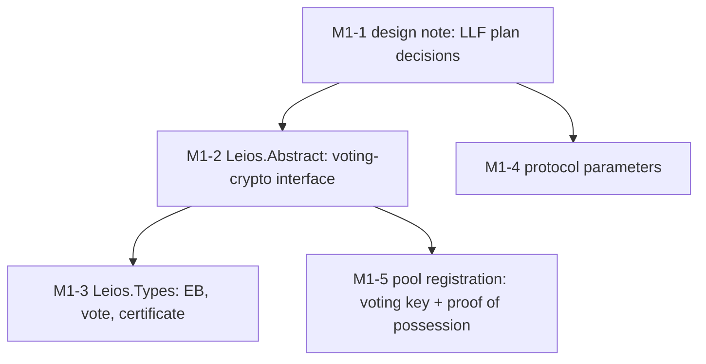
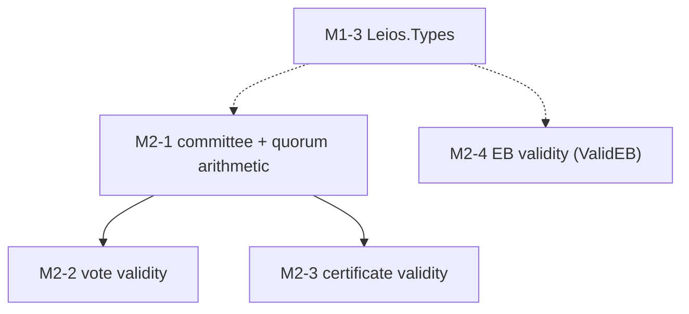
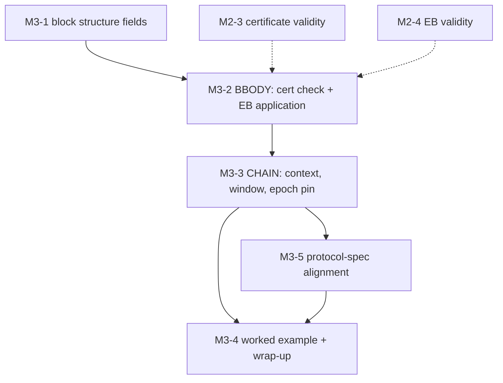
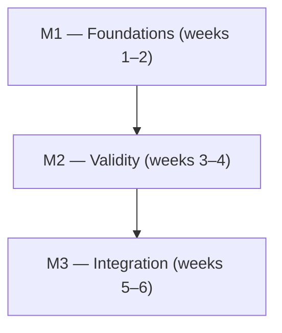

<!--
File: docs/GITHUB_PROJECT_6WEEK.md

Six-week core plan for the Leios ledger formalization, staged on the
`leios-main` branch.  This is the executable carve-out of the full
roadmap in docs/GITHUB_PROJECT.md: same repository, same branch
workflow, a fraction of the scope.  At most ONE of the two plan files
may be populated to GitHub (their `[MN-k]` issue prefixes and
`milestone-N-*` labels would collide); the intent is that THIS file is
populated and the full roadmap remains the long-range reference.

This file is partially generated by the williamdemeo/github-project
engine.  Issue listings between BEGIN/END GENERATED markers are the
input to the first `populate` run; after that they are regenerated from
GitHub state by `update`.  Never run update before the first populate.

STATUS: populated to the fork 2026-08-18; the generated regions
mirror the fork's issues.

    python3 <engine>/scripts/gh_project_lint.py     docs/GITHUB_PROJECT_6WEEK.md
    python3 <engine>/scripts/gh_project_populate.py docs/GITHUB_PROJECT_6WEEK.md --dry-run
-->

# Leios ledger formalization — six-week core plan

**Project Title**:  The Leios Ledger Formalization (LLF) — CIP-164 ledger rules in the Dijkstra era

**Repository**:  `williamdemeo/formal-ledger-specifications`

---

## Summary

A six-week plan for two people (William and Carlos) to produce the
initial Leios Ledger Formalization (LLF), a coherent, type-checking
formalization of the ledger aspects of Ouroboros Linear Leios (CIP-164)
in the Dijkstra-era spec: the new types, the new
protocol parameters, the voting key in pool registration, the
committee, the validity predicates for votes, certificates, and
endorser blocks, and the integration of certificate checking and
certified-EB application into the BBODY and CHAIN rules.  Properties, conformance testing, Haskell extraction, and reward or
incentive changes are deliberately out of scope; they are collected in the Follow-up work section at the end,
with pointers into the full roadmap (`docs/GITHUB_PROJECT.md`).

Five decisions keep the scope this small; the design note (M1-1)
records them and circulates them, and none of them blocks the Agda:

1.  **Full rules, not reapply.**  The spec applies a certified EB's
    transactions with the ordinary iterated LEDGER rule (`LEDGERS`),
    exactly as BBODY already applies block transactions.  CIP-164 says
    phase-1 and phase-2 validation apply equally to RB and EB
    transactions; skipping re-validation is an implementation
    optimization, justified later by the soundness theorem (follow-up).
    This dissolves the reapply-relation design question for now.
2.  **Relational spec needs no failure taxonomy.**  An invalid
    certificate simply admits no BBODY transition; distinguishable
    predicate failures are a `Computational`/conformance concern
    (follow-up).
3.  **Crypto stays local and abstract.**  A `LeiosAbstract` interface
    inside the Dijkstra namespace, not a change to `Ledger.Core`;
    migration of the aggregate-signature abstraction to the core (where
    Peras could share it) is follow-up.
4.  **Committee as data, selection abstract first.**  The committee is
    a concrete data structure with quorum arithmetic; the stake-based
    truncation that produces it is specified abstractly (signature and
    laws); the order itself (descending stake, ties by ascending pool
    id) is pinned as a law, and only the concrete construction may come
    later.
5.  **Defaults over debates.**  Where a design question has a CIP-164
    answer or a prototype precedent, the LLF takes it and records
    it; implementer feedback is gathered in parallel and folded in
    later, never awaited.

Work happens on `leios-main` under the workflow in `CONTRIBUTING.md`
(branch off `leios-main`, PR back to `leios-main`).  The umbrella
tracking issue is
[#1295](https://github.com/IntersectMBO/formal-ledger-specifications/issues/1295).

Budget check: the fourteen issues below carry effort estimates summing
to about 36 person-days, against roughly 50 working days available to
two people in six weeks; the slack absorbs review cycles and the
unknowns that a first formalization always finds.

---

## Labels

The `milestone-N-*` labels are load-bearing: populate attaches them,
and update uses them to map issues to generated regions.  The remaining
labels already exist on the repository and are reused exactly as named
there.

- `milestone-1-foundations` (d93f0b) — Milestone 1: Interface, types, and parameters.
- `milestone-2-validity` (fbca04) — Milestone 2: Committee and validity predicates.
- `milestone-3-integration` (0e8a16) — Milestone 3: Block and chain rules.
- `Leios` (c58af2) — Ouroboros Leios.
- `era: dijkstra` (d4c5f9) — Dijkstra-era specification.
- `discussion` (006b75) — Needs a design discussion or decision.
- `documentation` (0075ca) — Documentation.

---

## Milestones

### Milestone 1 — Foundations: interface, types, and parameters

**Description:**

Weeks 1–2.  The design note with the LLF plan decisions, the
abstract voting-crypto interface, the Leios primitive types, the new
protocol parameters, and the voting key in pool registration.
Suggested split: the note is joint work in the first two days; then one
person takes the new modules (M1-2, M1-3) and the other the edits to
existing modules (M1-4, M1-5).

**Exit criterion:**

`leios-main` type-checks under `--safe` with `Leios.Abstract` and
`Leios.Types` in place, the parameter record extended (including the
`τ < σ_c` well-formedness constraint), and pool registration carrying
and checking the voting key.  The design note is merged and has been
sent to the implementers for parallel comment.

Issue dependencies:



---

### Milestone 2 — Validity: committee, votes, certificates, endorser blocks

**Description:**

Weeks 3–4.  The semantic core: the committee with its quorum
arithmetic, and the three validity predicates — what a well-formed vote
is, what a valid certificate is, and what an endorser block must
satisfy for honest voters to endorse it (`ValidEB`, the property a
certificate ultimately certifies).  Suggested split: one person takes
the committee and certificate validity (they share the quorum
arithmetic), the other vote validity and `ValidEB`.

**Exit criterion:**

`ValidVote`, `ValidCert`, and `ValidEB` type-check under `--safe`, each
with a module-prose paragraph mapping its conjuncts to CIP-164's text
(the six vote-casting conditions, the five certificate-validation
checks), and each stated against
the committee/quorum definitions of M2-1.  The committee order
(descending stake, ties by ascending pool id) is pinned as a law of the
selection function.

Issue dependencies:



---

### Milestone 3 — Integration: block and chain rules

**Description:**

Weeks 5–6.  Put Leios into the rules: block-structure fields, the BBODY
premises (certificate-or-transactions, certificate validity against the
pinned committee, certified-EB application via `LEDGERS` from the
announcing state), and the CHAIN threading (the pending announcement,
the timing window, the epoch
pin), and a pinned cross-check against the protocol-level Agda spec
(M3-5).  Ends with a worked example and a
wrap-up pass that turns everything learned into the follow-up list.
Suggested split: one person
takes M3-1 and M3-2, the other M3-3 and M3-5; M3-4 is joint.

**Exit criterion:**

The extended CHAIN rule type-checks under `--safe` and accepts exactly
the story in the worked example: announce, wait out the window, certify
with a valid quorum, apply the EB's transactions, reject a block whose
certificate is invalid or early.  CI is green on `leios-main`, and the
design note's as-built deltas are recorded.  The correspondence table
against a pinned revision of ouroboros-leios-formal-spec exists, with
divergences routed upstream.

Issue dependencies:



---

### Milestone dependencies

Hand-authored; update never touches it.



---

## Module map

New modules slot under `Ledger.Dijkstra.Specification` as a `Leios`
subtree; six existing modules get edits.  Rule modules keep their usual
`(txs : TransactionStructure) (abs : AbstractFunctions txs)` telescope,
so protocol parameters, crypto, and epoch structure stay ambient.

```text
src/Ledger/Dijkstra/Specification/
├── Leios/
│   ├── Abstract.lagda.md       -- NEW  LeiosAbstract: abstract voting crypto (M1-2)
│   ├── Types.lagda.md          -- NEW  EndorserBlock, Vote, Certificate, ... (M1-3)
│   └── Validity.lagda.md       -- NEW  Seat, Committee, quorum arithmetic (M2-1);
│                               --      ValidVote, ValidCert, ValidEB (M2-2..M2-4)
├── Gov/Base.lagda.md           -- EDIT +leiosAbstract field in GovStructure (M1-2)
├── Transaction.lagda.md        -- EDIT supply leiosAbstract via TransactionStructure (M1-2)
├── PParams.lagda.md            -- EDIT +Leios parameter block, groups, τ<σ_c (M1-4)
├── Certs.lagda.md              -- EDIT +votingKey in StakePoolParams, proof-of-possession premise (M1-5)
├── BlockBody.lagda.md          -- EDIT +announcement/cert fields, BBODY premises (M3-1, M3-2)
└── Chain.lagda.md              -- EDIT +PendingEB threading, window check (M3-3)
```

Import order (each layer sees the previous ones):
`Leios.Abstract` → `Leios.Types` → `Leios.Validity` → `BlockBody` →
`Chain`.  Threading the abstract crypto as a `GovStructure` field
supplied through `TransactionStructure` (rather than a new module
parameter) means the signatures of `BlockBody` and `Chain` do not
change, so downstream modules (`Computational`, `Foreign`) keep
compiling with minimal churn.  Since `BlockBody` imports the Leios modules, the era's
import closure (and hence CI and the docs site) picks them up
automatically.

---

## Predicted new Agda types

Best-guess sketches, in the spec's house style, to be settled in M1-2,
M1-3, and M2-1.  Names follow CIP-164; the CDDL correspondence is noted
inline.

```agda
-- Leios/Abstract.lagda.md — record LeiosAbstract : Type₁
-- Abstract voting crypto: BLS in the implementation, scheme-agnostic here.
record LeiosAbstract : Type₁ where
  field
    VotingKey EBHash    : Type            -- key: 96-byte BLS vkey on the wire
    VotingSig AggSig    : Type
    KeyProof            : Type            -- proof of possession
    TxRefHash           : Type            -- hash of the COMPLETE tx bytes (CIP App. B)
    isSignedVote  : VotingKey → Slot × EBHash → VotingSig → Type
    isSignedAgg   : List VotingKey → Slot × EBHash → AggSig → Type
    validKeyProof : VotingKey → KeyProof → Type
    hashEBRefs    : List (TxRefHash × ℕ) → EBHash
    -- plus DecEq instances and decidability of the three predicates
```

The message type is literally `Slot × EBHash` (the CIP signs
`concat(slot_no, endorser_block_hash)`); signing the pair directly
avoids serialization plumbing.  `hashEBRefs` fixes the EB identifier as
the hash of the reference structure itself, checkable before any
transaction data is fetched.  References hash the complete transaction
bytes, not the body-identity `TxId`: a `(TxId, size)` pair could not pin
witnesses (settled in the m1-2 review; the as-built module matches this
sketch).

```agda
-- Leios/Types.lagda.md
record EndorserBlock : Type where
  field
    ebTxRefs : List (TxRefHash × ℕ)  -- ordered references: hash and declared size
    -- CDDL: omap⟨hash32, uint16⟩; duplicate-freedom is a validity
    -- condition (alternative: carry a uniqueness proof field)

Announcement : Type
Announcement = EBHash × ℕ          -- header fields announced_eb, announced_eb_size

record Vote : Type where
  field
    vSlot  : Slot                  -- slot of the announcing block
    vEB    : EBHash
    vVoter : ℕ                     -- index into the epoch committee
    vSig   : VotingSig             -- over (vSlot , vEB)

record Certificate : Type where
  field
    cSlot    : Slot
    cEB      : EBHash
    cSigners : ℙ ℕ                 -- CDDL: bitfield over committee seats
    cSig     : AggSig
```

```agda
-- Leios/Validity.lagda.md (committee structures)
record Seat : Type where
  field
    seatPool  : KeyHash
    seatKey   : Maybe VotingKey    -- keyless seats exist (REQ-KeylessSeat):
    seatStake : Coin               -- they hold stake but cannot sign

record Committee : Type where
  field
    seats : List Seat              -- descending-stake order fixes voter indices
  -- derived: committeeSize, seatAt : ℕ → Maybe Seat,
  --          signersStake : ℙ ℕ → Coin, keysAt : ℙ ℕ → List VotingKey

-- stake-based truncation at coverage σ_c; abstract signature first,
-- the concrete descending-order construction only if time allows
selectCommittee : UnitInterval → (KeyHash ⇀ Coin) → Pools → Committee
```

```agda
-- Leios/Validity.lagda.md — shapes, not final statements
ValidVote : Committee → Vote → Type
ValidCert : Committee → Coin → PParams → Slot × EBHash → Certificate → Type
  -- committee, total active stake, params (τ), the expected announcement

ValidEB : LedgerEnv → LedgerState → EndorserBlock → List TopLevelTx → Type
ValidEB Γ ls eb txs =
      MatchesRefs eb txs                        -- ids and sizes match pointwise
    × txs ≢ []                                  -- CIP: empty EBs are invalid
    × WithinEBBounds pp eb txs                  -- S_EB, S_EB-tx, per-EB ExUnits
    × ∃[ ls' ] Γ ⊢ ls ⇀⦇ txs ,LEDGERS⦈ ls'      -- valid extension (full rules)
```

```agda
-- Chain.lagda.md — threading between the announcing and certifying block
record PendingEB : Type where
  field
    peAnn      : Announcement
    peSlot     : Slot              -- slot of the announcing block
    peCommittee : Committee        -- pinned: committee of the announcing epoch
    peTotStake : Coin

-- ChainState gains:  leiosPending : Maybe PendingEB
```

```agda
-- Certs.lagda.md — StakePoolParams gains one field
    votingKey : Maybe (VotingKey × KeyProof)
-- POOL-reg / POOL-rereg gain the premise
--   ∀ registered key: validKeyProof (proj₁ k) (proj₂ k)

-- PParams.lagda.md — the Leios block (groups per the design note)
    leiosHeaderDiffusionPeriod  : ℕ             -- L_hdr, in slots
    leiosVotingPeriod           : ℕ             -- L_vote
    leiosDiffusionPeriod        : ℕ             -- L_diff
    leiosMaxEBSize              : ℕ             -- S_EB, bytes
    leiosMaxEBTxsSize           : ℕ             -- S_EB-tx, bytes
    leiosCommitteeStakeCoverage : UnitInterval  -- σ_c
    leiosQuorumStakeThreshold   : UnitInterval  -- τ; well-formedness: τ < σ_c
    leiosMaxEBExUnits           : ExUnits       -- per-EB Plutus budgets
    leiosMaxRefScriptSizePerEB  : ℕ             -- from cardano-ledger #5965
```

One deliberate spec-versus-wire difference: the wire format carries a
`certified_eb` bit in the header (a syncing optimization); in the spec
it is determined by the presence of the body's certificate, so the
LLF models the certificate field only and records the equivalence
in module prose.

---

## Issues

Each issue carries its milestone, labels, an effort estimate, and a
pointer to its counterpart in the full roadmap
(`docs/GITHUB_PROJECT.md`).  On first populate, the `[MN-k]` ID in each
heading becomes a title prefix on GitHub and the new issue number is
written back as a `(#N)` suffix.

## Milestone 1 — Foundations: interface, types, and parameters

<!-- BEGIN GENERATED: milestone-1 -->

### Issue M1-1: Design note: the Leios Ledger Formalization plan decisions (#2, closed)

**Labels:** `documentation`, `milestone-1-foundations`, `Leios`, `discussion`

Two to three pages, timeboxed to two days, merged as `docs/leios/design-note.md` on `leios-main`.  It records the defaults the Leios Ledger Formalization (LLF) plan builds on, so that every later issue encodes rather than debates:

- [ ] Module placement: the `Leios` subtree of `Ledger.Dijkstra.Specification` (the module map in `docs/GITHUB_PROJECT_6WEEK.md`).
- [ ] Certified application uses the full `LEDGERS` relation; reapply is an implementation optimization to be justified by the follow-up soundness theorem.
- [ ] Environment and ordering: EB transactions apply from the announcing block's post-BBODY state, before any tick to the certifying block's slot; a certificate-bearing block carries no transactions of its own (CIP-164).
- [ ] Certificate failure is the absence of a BBODY transition; no predicate-failure taxonomy in the LLF plan.
- [ ] Committee: epoch-fixed, stake-based truncation over registered voting keys; pinned at announcement; keyless seats hold stake but cannot sign.
- [ ] Parameters: the CIP-164 Table 3 list plus the per-EB reference-script bound from cardano-ledger #5965, with group assignments.
- [ ] Availability: the rules take the EB's transaction closure as input, with a matching premise; no availability obligations.
- [ ] The interface table: each function from the proposed consensus↔ledger interface mapped to its LLF counterpart or marked follow-up/consensus-only.

Send the merged note to Dražen, Javier, Nicolas, Alexey, and Polina for comment; feedback is folded in during M3-4, never awaited.

Estimated effort: 2 days (joint).

Full-roadmap counterpart: M0-9, compressing the M0-2..M0-8 corners into recorded defaults.

Amendments (2026-08-19 field review, from the Musashi trace-verifier work; shipped in commit 4f8b67f4e on this branch, PR #15):

- [x] Pending-EB lifetime made explicit: any applied block replaces the pending announcement with its own (possibly absent) one; no announcement survives an intervening block (protocol-level spec: the certifiable EB is the one announced by `currentRB`, the head).
- [x] Certifiability stated plainly: parameter well-formedness does not imply a reachable quorum; keyless seats hold coverage stake but cannot sign (field evidence: the Musashi certification outage of 2026-08-12/13, ouroboros-leios#1046 — participating weight at 73% against a 75% quorum).
- [x] The committee order (descending stake, ties by ascending pool id) is a stated law of the abstract selection function, with determinism required and the byte-exact pool-id comparison flagged upstream.
- [x] Known constant divergence recorded: prototype `minCertificationGap` = 10 versus the formula's 14 with the Musashi parameters.
- [x] The EB-identifier hash preimage marked as a conformance cliff (byte-exact preimage to be pinned before conformance testing).
- [x] Rewards and incentives declared out of scope, with the CIP's own words.

---

### Issue M1-2: `Leios.Abstract`: the abstract voting-crypto interface (#3)

**Labels:** `milestone-1-foundations`, `Leios`, `era: dijkstra`

## Description

New module `Ledger.Dijkstra.Specification.Leios.Abstract` with the `LeiosAbstract` record sketched in the plan's "Predicted new Agda types" section: abstract types for voting keys, signatures, aggregate
signatures, proofs of possession, EB hashes, and transaction-reference hashes (`TxRefHash`: the hash of the complete transaction bytes, per CIP-164 Appendix B); verification predicates over the message `Slot × EBHash`; the EB-reference hash function; decidability instances.

- [ ] Define the record; keep it scheme-agnostic (CIP-164 Appendix A); no concrete curve arithmetic, `--safe` throughout.
- [ ] Thread it as a new `leiosAbstract` field of `GovStructure` (`Gov/Base.lagda.md`), supplied through `TransactionStructure`, so downstream module signatures do not change.  (Revised during review: `Certs` sees only `GovStructure` and sits upstream of `AbstractFunctions`, so an `AbstractFunctions` field cannot reach the registration rule's proof-of-possession premise.)
- [ ] Module prose: one paragraph on the BLS12-381 instantiation and the Peras-sharing intent, with the core-migration noted as follow-up.

Estimated effort: 2 days.  
Full-roadmap counterpart: M1-1 (scoped down: Dijkstra-local, no `Ledger.Core` change).

---

### Issue M1-3: `Leios.Types`: endorser blocks, votes, certificates (#4)

**Labels:** `milestone-1-foundations`, `Leios`, `era: dijkstra`

New module `Ledger.Dijkstra.Specification.Leios.Types` with `EndorserBlock` (ordered transaction references: `TxRefHash` and declared size), `Announcement`, `Vote`, and `Certificate`, per the sketches in the plan.

- [ ] Records and `DecEq` instances; EB identifier via `hashEBRefs`.
- [ ] References carry `TxRefHash`, not `TxId`: the body-identity `TxId` cannot pin witnesses, while CIP-164 Appendix B fixes the reference hash over the complete transaction bytes (established in the m1-2 review; `LeiosAbstract` already provides the carrier and `hashEBRefs : List (TxRefHash × ℕ) → EBHash`).  `EndorserBlock` is therefore `List (TxRefHash × ℕ)`.
- [ ] Module prose marks the EB-identifier boundary as a known conformance cliff: the identifier is `hashEBRefs` of the reference structure with the byte-exact preimage deliberately unpinned; pinning it is a named follow-up prerequisite for conformance testing (Cardano precedent: the block-body hash's segmented preimage exists only in implementation internals).
- [ ] Decide the duplicate-freedom representation (validity condition versus proof field) and record the choice in module prose.
- [ ] Module prose maps each type to its CIP-164 CDDL counterpart (Appendix B), including the note that the header's `certified_eb` bit is spec-derived.

Estimated effort: 2 days.

Full-roadmap counterpart: M1-2.

---

### Issue M1-4: Protocol parameters: the Leios block (#5)

**Labels:** `milestone-1-foundations`, `Leios`, `era: dijkstra`

Extend `PParams` in `Ledger.Dijkstra.Specification.PParams` with the nine Leios fields sketched in the plan (periods, sizes, `σ_c`, `τ`, per-EB budgets, per-EB reference-script bound), following the record's existing comment-grouped style.

- [ ] Fields in `PParams`, with `PParamGroup` assignments per the design note (`τ` and `σ_c` also in `SecurityGroup`).
- [ ] The mechanical companions: `PParamsUpdate` fields, the `modifies*Group` functions, `modifiedUpdateGroups`.
- [ ] Well-formedness: `τ < σ_c` (CIP-164 normative) and positivity of the periods and sizes, in the params well-formedness predicate.
- [ ] Cross-check names and types against cardano-ledger #5965 (`SlotInterval`/`UnitInterval`/`Word32`/`OrdExUnits` there); note divergences in module prose.

Estimated effort: 3 days (the update machinery is wide but mechanical).  Full-roadmap counterpart: M1-3.

---

### Issue M1-5: Pool registration: voting key and proof of possession (#6)

**Labels:** `milestone-1-foundations`, `Leios`, `era: dijkstra`

Extend `StakePoolParams` in `Ledger.Dijkstra.Specification.Certs` with `votingKey : Maybe (VotingKey × KeyProof)` and make registration check it.

- [ ] The field, plus `DecEq` derivation updates.
- [ ] `POOL-reg` and `POOL-rereg` gain the premise that a registered key's proof of possession is valid (`validKeyProof`).
- [ ] Module prose: re-registration is the interim rotation mechanism; CIP-164 defers the real one to a follow-up amendment; the prototype stores this key but never checks the proof (a divergence worth flagging upstream when convenient).

Estimated effort: 2 days.  Full-roadmap counterpart: M1-4.

<!-- END GENERATED: milestone-1 -->

## Milestone 2 — Validity: committee, votes, certificates, endorser blocks

<!-- BEGIN GENERATED: milestone-2 -->

### Issue M2-1: Committee, seats, and quorum arithmetic (in `Leios.Validity`) (#7)

**Labels:** `milestone-2-validity`, `Leios`, `era: dijkstra`

In `Ledger.Dijkstra.Specification.Leios.Validity`, the module shared with M2-2..M2-4 (the separate `Leios.Committee` module was folded into it by the 2026-08-25 design decision): the `Seat`/`Committee` structures from the plan's sketches and the arithmetic that vote and certificate validity consume.

- [ ] `Seat` (pool, optional voting key, stake) and `Committee` (a seat list whose order fixes voter indices), with `seatAt`, `committeeSize`, `signersStake`, `keyedStake` (the stake of the keyed seats), and the keys of a signer set.
- [ ] Quorum: `signersStake s ≥ τ * totalActiveStake`, stated over `Coin` and `UnitInterval` the way the rest of the spec does rational comparisons.
- [ ] `selectCommittee : UnitInterval → (KeyHash ⇀ Coin) → Pools → Committee`, abstractly: state the signature and its laws, and pin the order in the laws even though the construction may come later.  The laws: membership is stake-based truncation at coverage `σ_c` over the epoch's pool-stake distribution, independent of voting-key registration (keyless seats occupy their places; design doc REQ-KeylessSeat); the seat order is descending stake with ties broken by ascending pool id (design doc "Committee selection"; the prototype stable-sorts by pool id).  The order is consensus-critical: certificate bitfields address seat indices, and near-tie pools reshuffle indices every epoch on the testnet, so determinism is a law, not a nicety.  The tie-break needs a total order on the pool-id type; introduce it as a module parameter or instance, and flag the byte-exact comparison as a conformance detail to confirm upstream.
- [ ] `certifiable`: define (as a plain definition, never a rule premise) the reachability predicate `keyedStake committee ≥ τ · totalActiveStake`, and record in module prose that parameter well-formedness (`τ < σ_c`) does not imply it: keyless seats hold coverage stake but cannot sign.
- [ ] Worked examples in module prose: (a) a five-pool stake distribution, the resulting seats and indices, including an equal-stake tie resolved by pool id; (b) a committee where every rule is satisfied and yet `certifiable` fails (the Musashi outage shape, ouroboros-leios#1046: participating weight at 73% against a 75% quorum threshold, so almost no EBs certified for hours).

Estimated effort: 4.5 days (the hardest module: ordering and arithmetic).

Full-roadmap counterpart: M1-5.

---

### Issue M2-2: Vote validity (#8)

**Labels:** `milestone-2-validity`, `Leios`, `era: dijkstra`

In `Ledger.Dijkstra.Specification.Leios.Validity`: `ValidVote`, the ledger-checkable part of CIP-164's vote conditions.

- [ ] The voter index denotes a keyed seat of the committee; the signature verifies under that seat's key over `(vSlot , vEB)`.
- [ ] Module prose records the split: which of the six CIP vote-casting conditions are ledger-checkable conjuncts here, and which are node-local timing/equivocation conditions that the protocol-level spec (`ouroboros-leios-formal-spec`) carries.
- [ ] Decidability instance.

Estimated effort: 1.5 days.  Full-roadmap counterpart: M2-3.

---

### Issue M2-3: Certificate validity (#9)

**Labels:** `milestone-2-validity`, `Leios`, `era: dijkstra`

In `Leios.Validity`: `ValidCert`, the intrinsic checks of CIP-164's "Certificate Validation" section, against a given committee, total active stake, and expected announcement.

- [ ] Signers are indices of keyed seats of the committee: no bit set on a keyless seat; a certificate whose bitfield names a keyless seat is invalid (design doc REQ-LedgerCertificateVerification).  The aggregate signature verifies over the signers' keys and `(cSlot , cEB)`.
- [ ] Quorum: the signers' stake meets `τ` (arithmetic from M2-1).
- [ ] Consistency: the certificate's slot and EB hash equal the expected announcement (the contextual half is supplied by BBODY in M3-2, which passes the pinned pending announcement).
- [ ] Module prose maps the five CIP checks to conjuncts (CDDL compliance is structural typing; the rest are explicit).
- [ ] Decidability instance.

Estimated effort: 2 days.

Full-roadmap counterpart: M2-4.

---

### Issue M2-4: EB validity: `ValidEB` (#10)

**Labels:** `milestone-2-validity`, `Leios`, `era: dijkstra`

In `Leios.Validity`: `ValidEB`, the property a certificate certifies, per the sketch in the plan: reference/payload matching, nonemptiness, the EB bounds, and the valid-extension conjunct via `LEDGERS` from the announcing block's state.

- [ ] `MatchesRefs` (pointwise id-and-size agreement between `ebTxRefs` and the transaction list) and `WithinEBBounds` (`S_EB`, `S_EB-tx`, per-EB `ExUnits`, per-EB reference-script size), with the accounting helpers they need.
- [ ] The valid-extension conjunct: `∃[ ls' ] Γ ⊢ ls ⇀⦇ txs ,LEDGERS⦈ ls'` — reusing the iterated LEDGER rule exactly as BBODY does, so nested transactions and batches behave identically to block transactions with no extra work.
- [ ] Module prose: what honest voters check, and why the LLF applies full rules at certification time (design-note default 1).

Estimated effort: 3 days.  Full-roadmap counterpart: M2-1 (with the full plan's M2-2 voting-state interface deferred to follow-up).

<!-- END GENERATED: milestone-2 -->

## Milestone 3 — Integration: block and chain rules

<!-- BEGIN GENERATED: milestone-3 -->

### Issue M3-1: Block structure: announcement, certificate, payload (#11)

**Labels:** `milestone-3-integration`, `Leios`, `era: dijkstra`

Extend the block types in `Ledger.Dijkstra.Specification.BlockBody`:

- [ ] `BHBody` gains the optional announcement (`Maybe Announcement`).
- [ ] `Block` gains the optional certificate and, alongside it, the certified EB with its transaction closure as rule input (`Maybe (Certificate × EndorserBlock × List TopLevelTx)` or equivalent), per the availability default of the design note.
- [ ] Structural consistency in the style of the existing `≡-bBodySize` fields where needed; the wire-level `certified_eb` bit is derived, not modeled.

Estimated effort: 2 days.  Full-roadmap counterpart: M3-1.

---

### Issue M3-2: BBODY: certificate check and certified-EB application (#12)

**Labels:** `milestone-3-integration`, `Leios`, `era: dijkstra`

Extend the BBODY rule with the Leios premises, taking the pending announcement (from M3-3's chain context) as part of the environment:

- [ ] Certificate-or-transactions: a block carrying a certificate carries no transactions of its own.
- [ ] With a certificate: `ValidCert` against the pinned committee, total stake, and pending announcement; `MatchesRefs`, nonemptiness, and bounds for the supplied payload; then the payload applied via `LEDGERS` from the pending (announcing) state per the design-note ordering.
- [ ] Without a certificate: the rule is definitionally the existing one (check this by keeping the old premises untouched on that branch).
- [ ] Blocks-made accounting and size/hash checks unchanged.

Estimated effort: 4 days.  Full-roadmap counterpart: M3-2 (minus the predicate-failure taxonomy, which is follow-up).

---

### Issue M3-3: CHAIN: pending announcement, timing window, epoch pin (#13)

**Labels:** `milestone-3-integration`, `Leios`, `era: dijkstra`

Extend `ChainState` and the CHAIN rule in `Ledger.Dijkstra.Specification.Chain`:

- [ ] `leiosPending : Maybe PendingEB` in the chain state: the immediate parent's announcement with its slot, the committee pinned at the announcing epoch, and the total active stake used for the quorum.
- [ ] Pending-EB lifetime: `leiosPending` is a function of the block just applied.  CHAIN replaces it, unconditionally, with that block's own announcement (nothing when the block announces nothing).  Announcements are optional, so an intervening announcement-less block ends the certifiability of its parent's EB; a certificate is admissible only for the EB announced by the immediate parent.  This matches CIP-164's direct-successor rule and the protocol-level spec, where the certifiable EB is the one announced by `currentRB`, the chain head (ouroboros-leios-formal-spec: `Leios/Protocol.lagda.md`, and the `Base₂` certificate premise in `Linear.lagda.md`).
- [ ] Window premise: a certificate is admissible only when the certifying block's slot is at least `3·L_hdr + L_vote + L_diff` after the announcing slot; there is no later opportunity.
- [ ] Known implementation divergence, recorded in module prose and flagged upstream (the M1-5 proof-of-possession note is the pattern): the prototype's `minCertificationGap` is 10 slots, while the formula gives 14 with the Musashi parameters; both sides are live and have been measured by the trace-verifier work.
- [ ] The pin realizes the epoch-straddle default: a certificate landing after an epoch boundary is still checked against the announcing epoch's committee.  Parameter changes inside the window follow the design-note default; record the choice in module prose (the CIP is silent, so this is one to surface to the implementers).
- [ ] Ordering relative to the epoch machinery per the design note (EB application from the pre-tick announcing state).

Estimated effort: 4 days.

Full-roadmap counterpart: M3-3.

---

### Issue M3-4: Worked example, umbrella module, wrap-up (#14)

**Labels:** `documentation`, `milestone-3-integration`, `Leios`, `era: dijkstra`

Close the six weeks with the artifacts that make the LLF usable by others:

- [ ] A slot-by-slot worked example in module prose (in `Chain` or `Leios.Validity`): announce, window, certify, apply; plus the negative cases the field data says matter: an early certificate, an intervening announcement-less block that ends its parent EB's certifiability, and a keyless-heavy committee period in which no certificate can exist although every rule holds; plus an epoch-straddle case.
- [ ] Overview prose tying the Leios pieces together, in the `Leios.Validity` and `Chain` module headers, iterative-deepening style per house convention (the umbrella re-export module was cut from the design, 2026-08-25).
- [ ] Fold in any implementer feedback on the design note received since M1-1; record as-built deltas in the note.
- [ ] Re-check the protocol-spec correspondence table (M3-5) against the then-current tip of ouroboros-leios-formal-spec; record any drift.
- [ ] Update the follow-up list in this plan from what the six weeks actually surfaced; confirm CI is green on `leios-main`.

Estimated effort: 2.5 days (joint).

Full-roadmap counterpart: parts of M0-9 and M5-3.

---

### Issue M3-5: Protocol-spec alignment: pin and cross-check ouroboros-leios-formal-spec (#18)

**Labels:** `documentation`, `milestone-3-integration`, `Leios`

Two Agda formalizations now model overlapping Leios structure: this ledger spec and the protocol-level `input-output-hk/ouroboros-leios-formal-spec`, which the trace-verifier work verifies against daily.  The shared surface must not silently diverge, and the protocol spec is moving: on the CIP-alignment branch (`yveshauser/cip-alignment`, spec PR #65) the trace verifier pins `eeb5b2d`, and the tip has since moved to `4607dd67`, which removed the ranking-block slot field and added certificate-xor-transactions, exactly the structures M3-1 and M3-2 model.

- [ ] Pin a protocol-spec revision (record the commit hash) and read the two key files: `formal-spec/Leios/Linear.lagda.md` (the `Base₂` certificate premise and the `VT-Role` window guards) and `formal-spec/Leios/Protocol.lagda.md` (`currentRB` is the head).
- [ ] Write the correspondence table, our premises against their guards: the window inequality `3·L_hdr + L_vote + L_diff`; certificate-xor-transactions; the vote message and its epoch keying; the pending-EB lifetime (any applied block replaces the pending announcement); committee indexing and the signer bitfield.  Note where representations legitimately differ (at last look their EBs carry transaction lists, ours carry references plus closure).
- [ ] Record divergences and route them upstream (review comments on spec PR #65, or new issues), and note the re-pin cadence: M3-4 re-checks against the then-current tip.
- [ ] Deliverable: `docs/leios/protocol-spec-alignment.md` on the branch, linked from the design note's sources.

Estimated effort: 1.5 days.

Full-roadmap counterpart: M0-1 (the interface extraction) and M5-3 (the traceability map).

<!-- END GENERATED: milestone-3 -->

---

## Follow-up work (deliberately out of scope)

Deferred to keep six weeks honest; each item points at its issue in the
full roadmap (`docs/GITHUB_PROJECT.md`), which remains the long-range
reference.

+  **Metatheory** — certified-application soundness (the theorem that
   justifies the implementation's reapply optimization; full plan
   M4-1), preservation of value through the new rules (M4-2), no
   double application (M4-3), quorum safety (M4-4).
+  **Executability and conformance** — `Computational` instances and a
   predicate-failure taxonomy for the new rules (M4-5, and the
   conformance-facing half of M0-5), Foreign/Haskell extraction
   (M5-1), conformance test vectors (M5-2), the living traceability
   map and upstream divergence filing (M5-3, M5-4).
+  **Property catalog** — register the Leios properties once the
   property-tracking tooling lands on `leios-main` (M4-6).
+  **Voting-state interface** — mechanize
   `initializeVotingLedgerState` / `applyTxForVoting` /
   `reapplyTxForVoting` / `forgetVotingLedgerState` as incremental
   structures over `ValidEB` (full plan M2-2); the design note's
   interface table already gives them their meanings.
+  **Committee concretization** — the descending-order truncation
   construction with its tie-break, and materializing the committee at
   the epoch boundary, if M2-1 ships the abstract form.
+  **Crypto in the core** — migrate the aggregate-signature abstraction
   from `Leios.Abstract` to `Ledger.Core` for sharing with Peras (full
   plan M1-1).
+  **Feature gating** — the protocol-version guard for pre-Leios
   Dijkstra blocks (full plan M3-5).
+  **Nested-transaction deep-dive** — per-EB budget accounting for
   sub-transactions and batch interactions beyond what `LEDGERS`
   already gives (full plan M3-4).
+  **Key rotation** — real rotation semantics when the CIP-164
   follow-up amendment lands (tracked in M1-5's prose meanwhile).
+  **Byte-exact EB-hash preimage** — the `hashEBRefs` abstraction leaves
   the EB identifier's preimage unpinned; pin it (with upstream) before
   conformance testing, or the cliff gets reverse-engineered later.
+  **Rewards and incentives** — none are modeled and CIP-164 requires
   none ("Leios does not require any changes to incentives in Cardano");
   if a Leios incentive mechanism ever becomes normative it enters
   through the full roadmap.

---

## Field-driven work outside the milestone plan

+  [#1295](https://github.com/IntersectMBO/formal-ledger-specifications/issues/1295)
   — the `[Leios]` umbrella tracking issue; this plan's summary belongs
   there once adopted.
+  Upstream references:
   [cardano-ledger #5626](https://github.com/IntersectMBO/cardano-ledger/pull/5626),
   [cardano-ledger #5965](https://github.com/IntersectMBO/cardano-ledger/issues/5965),
   [ouroboros-consensus #1793](https://github.com/IntersectMBO/ouroboros-consensus/pull/1793),
   the Leios design document (`ouroboros-leios`, `docs/leios-design`),
   and the protocol-level Agda spec
   (`input-output-hk/ouroboros-leios-formal-spec`).
